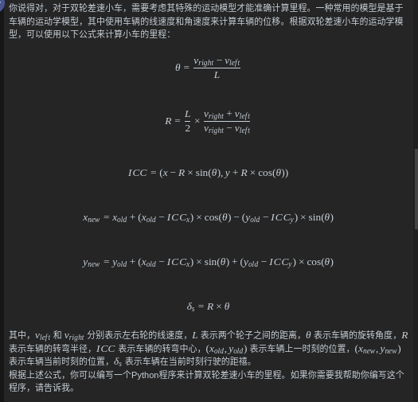

### 实验前准备
====================================================
#### 安装pigpio
1. 下载
    wget abyz.me.uk/rpi/pigpio/pigpio.zip
    unzip pigpio.zip
    cd PIGPIO
    make
    sudo make install

2. 启动pigpio: sudo pigpiod

3. 查看服务是否启动:  ps -ef | grep pigpiod

4. 设置开机自启动
    -  - 
    sudo nano /etc/systemd/system/pigpiod.service
    - - 
    [Unit]
    Description=Pigpio Daemon
    After=network.target

    [Service]
    Type=forking
    ExecStart=/usr/bin/sudo /usr/local/bin/pigpiod
    ExecStop=/usr/bin/sudo pkill pigpiod
    RemainAfterExit=yes

    [Install]
    WantedBy=multi-user.target
    - - 
    sudo systemctl enable pigpiod.service
    sudo systemctl start pigpiod.service
    - - 
    sudo systemctl status pigpiod.service
    - - 
    sudo systemctl daemon-reload

### 两轮小车运动模型
1. 网上资料参考： https://bluesnie.github.io/Learning-notes/ROS2/%E4%B8%A4%E8%BD%AE%E5%B7%AE%E9%80%9F%E7%A7%BB%E5%8A%A8%E6%9C%BA%E5%99%A8%E4%BA%BA%E5%BC%80%E5%8F%91%E7%AF%87/%E7%AC%AC16%E7%AB%A0-%E7%A7%BB%E5%8A%A8%E6%9C%BA%E5%99%A8%E4%BA%BA%E6%8E%A7%E5%88%B6%E7%B3%BB%E7%BB%9F%E6%90%AD%E5%BB%BA/010-%E4%B8%A4%E8%BD%AE%E5%B7%AE%E9%80%9F%E8%BF%90%E5%8A%A8%E5%AD%A6%E6%AD%A3%E9%80%86%E8%A7%A3.html
2. https://zhuanlan.zhihu.com/p/635908682
3. https://blog.csdn.net/qq_34935373/article/details/107605615

### 键盘控制
左前           右前           左转             右转
---
linear:       linear:       linear:          linear: 
  x: 0.1        x: 0.1          x: 0.0          x: 0.0
  y: 0.0        y: 0.0          y: 0.0          y: 0.0        
  z: 0.0        z: 0.0          z: 0.0          z: 0.0
angular:      angular:      angular:         angular:
  x: 0.0        x: 0.0          x: 0.0          x: 0.0
  y: 0.0        y: 0.0          y: 0.0          y: 0.0
  z: 0.1        z: -0.1         z: 0.1         z: -0.1
---

### 小车尺寸
1. 小车长13cm(0.065)， 宽10cm(0.05)  高10cm  小车头距离两轮间距0.022cm
2. 以小车两轮中心作为小车base_link的中心，那么小车在ros中模型为
    [Point(-0.108, -0.05, 0), Point(-0.108, 0.05, 0), Point(0.022, 0.05, 0), Point(0.022, -0.05, 0)]
3. 膨胀之后的小车尺寸
    [Point(-0.109, -0.051, 0), Point(-0.109, 0.051, 0), Point(0.023, 0.051, 0), Point(0.023, -0.051, 0)]

### 第二版（银灰色外壳小车）
#### 结构
1. 小车尺寸 长： 13厘米  宽：9.6厘米  高：9.7厘米
2. [Point(-0.023,-0.048,0),Point(-0.023,0.048,0),Point(0.108,0.048,0),Point(0.108,-0.048,0)]
3. [[-0.024,-0.049],[-0.024,0.049],[0.108,0.049],[0.108,-0.049] ]

#### 双轮差速小车里程算法

### 启动设备(小车、雷达)
1. roslaunch device uni_car.launch

### 程序框架介绍 2024-10-12 (记录)
#### 小车底层包
    catkin_ws
    -------build
    -------devel
    -------src
    -----------device
    ------------------config                           雷达切割配置文件
    ------------------include                          过程文件
    ------------------launch                           启动双轮差速小车的launch配置文件
    ------------------------uni_car.launch             启动小车底层的launch文件(含小车里程，主要为Gmapping、Hector导航服务)
    ------------------------device_actual.launch       启动小车底层的launch文件(不含小车里程，主要为Cartographer导航服务)
    ------------------------ ......                    其他launch文件不做说明，主要是调试小车的过程文件.
    ------------------scripts                          双轮差速小车pid程序(python)，以下主要列出小车pid算法的主要程序
    ------------------------uni_car_motor_l.py         单独驱动小车左轮pid（功能比较全面）
    ------------------------uni_car_motor_r.py         单独驱动小车右轮pid（功能比较全面）
    ------------------------uni_car_motor_left.py      单独驱动小车左轮pid
    ------------------------uni_car_motor_right.py     单独驱动小车右轮pid
    ------------------------uni_car_car.py             该程序使用了小车的里程
    ------------------------ ......                    其他程序省略(主要是实验的过程测试程序，这里不做说明)
    ------------------src                              用于存储C++程序的文件夹(目前小车底层驱动暂时没有使用C++程序)
    ------------------urdf                             双轮小车urdf模型文件
    -----------gpio_test                               树霉派zero 2w板子gpio引脚测试文件(用于学习)
    -----------third                                   树霉派zero 2w板子gpio驱动包
    -------kill_ros.sh                                 该程序用于结束ros所有节点
    -------readme.md                                   包文件整体概述
    CMakeLists.txt
    package.xml

#### 雷达驱动包
    ydlidar_ws
    -------build
    -------devel
    -------src
    ------------ydlidar_ros_driver 该包文件存储雷达驱动程序
